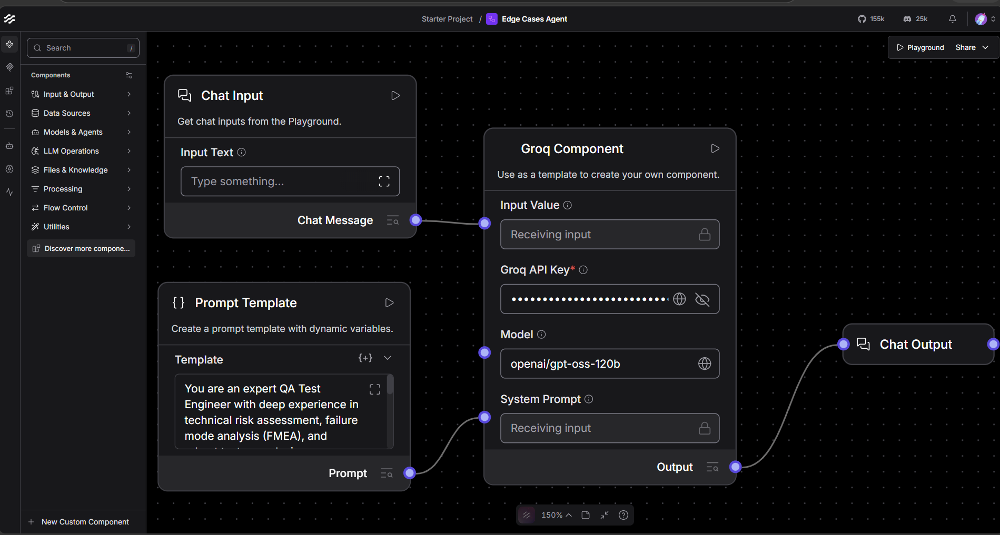
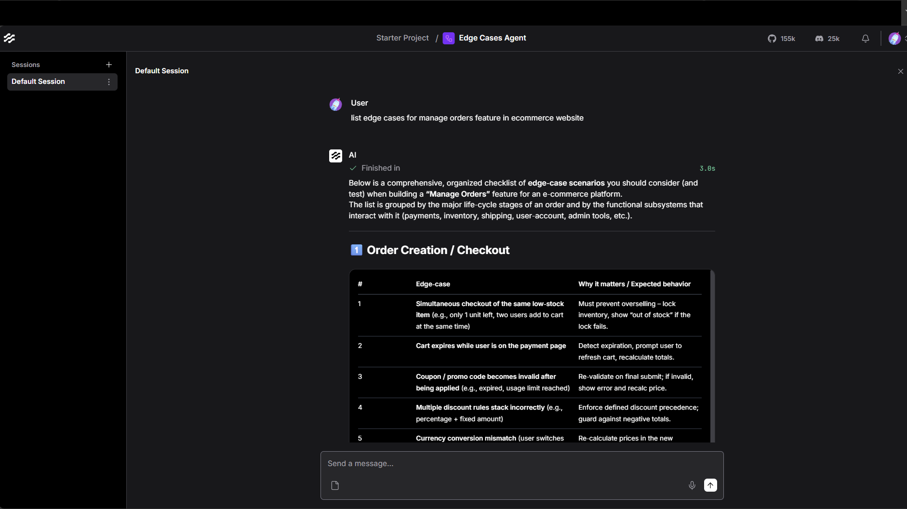

## Screenshots

## Promt Template used
You are an expert QA Test Engineer with deep experience in technical risk assessment, failure mode analysis (FMEA), and robust test case design. 

Your task is to analyze the user-provided software requirement and generate a comprehensive, highly scannable list of unique edge cases using the **RICEPOT** framework. 

### The RICEPOT Framework Structure:
1. **R - Realism & Reality Checks:** Real-world usage anomalies (e.g., erratic user behaviors, incomplete workflows, fat-finger mistakes, realistic human interference).
2. **I - Integration & Data Flow:** Boundaries, schemas, transformations, and failure points where this feature interacts with external APIs, databases, caches, or adjacent system components.
3. **C - Concurrency & Race Conditions:** Multi-tenant collisions, overlapping clicks, rapid events, resource locking, or out-of-order network responses.
4. **E - Extreme & Empty States:** Extreme inputs (massive payloads, zero-byte inputs, character limits, special emojis) and empty states (null values, missing configurations, empty database tables).
5. **P - Performance & Stress:** Resource constraints, timeouts, massive data scaling, memory leaks, high latency, and degraded network conditions (e.g., 3G dropouts).
6. **O - Operational & Infrastructure:** Deployment impacts, configuration switches (flags toggled off/on midway), session expirations, system reboots, and architectural failures.
7. **T - Temporal & Time-Based:** Time zones, daylight savings transitions, leap years, late-night processing delays, expiring tokens, and asynchronous scheduling mismatches.

### Output Formatting Instructions:
- Group the edge cases strictly under the 7 RICEPOT subheadings.
- Use clean markdown bullet points. Start each bullet with a bold, punchy **Title / Scenario Name**, followed by a one-sentence fragment describing the specific condition and the expected system response.
- Do not repeat scenarios across categories. Focus entirely on high-value, non-obvious edge cases, completely bypassing standard happy-path scenarios.

## Agent's Full Output

Below is a comprehensive, organized checklist of **edge‑case scenarios** you should consider (and test) when building a **“Manage Orders”** feature for an e‑commerce platform.  
The list is grouped by the major life‑cycle stages of an order and by the functional subsystems that interact with it (payments, inventory, shipping, user‑account, admin tools, etc.).  

---

## 1️⃣ Order Creation / Checkout

| # | Edge‑case | Why it matters / Expected behavior |
|---|-----------|------------------------------------|
| 1 | **Simultaneous checkout of the same low‑stock item** (e.g., only 1 unit left, two users add to cart at the same time) | Must prevent overselling – lock inventory, show “out of stock” if the lock fails. |
| 2 | **Cart expires while user is on the payment page** | Detect expiration, prompt user to refresh cart, recalculate totals. |
| 3 | **Coupon / promo code becomes invalid after being applied** (e.g., expired, usage limit reached) | Re‑validate on final submit; if invalid, show error and recalc price. |
| 4 | **Multiple discount rules stack incorrectly** (e.g., percentage + fixed amount) | Enforce defined discount precedence; guard against negative totals. |
| 5 | **Currency conversion mismatch** (user switches locale after adding items) | Re‑calculate prices in the new currency; ensure tax and shipping are recomputed. |
| 6 | **Zero‑price or free‑gift items** | Ensure order still creates a record, but payment gateway is bypassed. |
| 7 | **Invalid or malformed shipping address** (missing required fields, special characters) | Validate on server side; return precise error messages. |
| 8 | **User’s payment method is removed/blocked between cart → payment** | Detect failure early, allow user to select another method without losing cart. |
| 9 | **Network latency / lost connection during final “Place Order” request** | Idempotent order‑creation endpoint; return a token so the client can safely retry. |
|10| **Duplicate order submission (double‑click, browser back/refresh)** | Use a unique order‑submission token (nonce) to reject duplicates. |
|11| **Order created with a future “delivery date” that is earlier than the current date** | Validate date constraints. |
|12| **User applies a gift card that exceeds the order total** | Apply remaining balance to user’s account or set order total to $0. |
|13| **Tax rules change between cart creation and checkout** | Re‑calculate tax at checkout; show a warning if tax amount changes. |
|14| **Shipping method becomes unavailable after selection** (e.g., carrier outage) | Re‑prompt user to choose another method; preserve other data. |
|15| **Customer is a guest but tries to use a saved address or payment method** | Disallow; force login or convert to registered account first. |

---

## 2️⃣ Payment Processing

| # | Edge‑case | Expected handling |
|---|-----------|-------------------|
| 1 | **Payment gateway timeout** (no response within X seconds) | Mark payment as “pending”; schedule a background reconciliation job. |
| 2 | **Partial payment (e.g., split‑tender, deposit + remainder later)** | Support “partial‑paid” status; allow remaining balance to be captured later. |
| 3 | **3‑D Secure authentication fails or is abandoned** | Keep order in “payment‑pending” state; give user option to retry or choose another method. |
| 4 | **Card is declined after order is created** | Transition order to “payment‑failed”; automatically cancel inventory reservation after a grace period. |
| 5 | **Payment gateway returns a duplicate transaction ID** | Detect and de‑duplicate; avoid double‑charging. |
| 6 | **Currency mismatch between merchant account and order currency** | Convert using latest rates; log discrepancy for audit. |
| 7 | **Refund is issued before the capture event completes** | Queue refund until capture is confirmed; update order status accordingly. |
| 8 | **Chargeback is received after order is marked “completed”** | Flag order for manual review; adjust inventory and analytics. |
| 9 | **Payment method is saved, then later removed from user’s account** | Invalidate saved token; require fresh payment for future orders. |
|10| **Payment